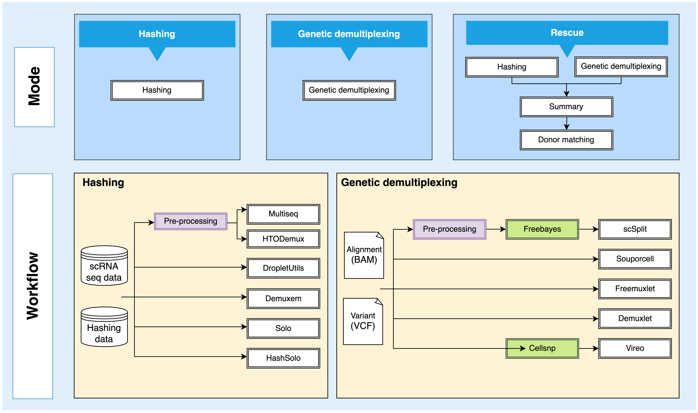

# hagen

[](https://www.nextflow.io/)
[](https://docs.conda.io/en/latest/)
[](https://www.docker.com/)
[](https://sylabs.io/docs/)


## **Introduction**
Hagen is a one-stop pipeline for demultiplexing single cell mixtures. It consists of 14 methods across two workflows: hashing-based and genetics-based deconvolution methods, which can be run in 3 modes. 

The genetics-based deconvolution workflow includes 5 methods: 
* Freemuxlet 
* Demuxlet
* Vireo
* Souporcell
* scSplit

The hashing-based deconvolution includes 9 methods: 
* hashedDrops
* Multiseq
* HTODemux
* Demuxem
* Solo
* HashSolo
* TODO

## **Installation**

The Hagen pipeline is implemented in Nextflow. To get started, you need to install Nextflow. Please refer to [Nextflow](https://www.nextflow.io/docs/latest/getstarted.html#installation) for more details. Alternatively, you can also install Nextflow via [conda](https://anaconda.org/bioconda/nextflow).

As next, please clone the repository
```
git clone https://github.com/theislab/hagen.git
cd hagen
```

If you want to use Souporcell later, you should also download the singularity image in the project directory with the command `singularity pull shub://wheaton5/souporcell`.


## **Quick start**
In the `nextflow.config` file, 
* Choose the mode: `mode = <genetic/hashing/rescue>`
* Speficy the folder name `outdir` to save the output files. This will create a folder automatically in the project directory.
* Speficy the input data for each process.
* We strongly recommend to run each process in a separate container or in a conda environment. As default, the process will run in different conda environemnts defined by the `environment.yml` files in the folder [conda](https://github.com/theislab/hagen/tree/main/conda). 
* The pipeline can be run either locally or on a HPC with different resource specifications. As default, the pipeline will run locally. You can also set the SLURM executor by running the pipeline with `-profile cluster`. 
* Please also check [usage.md](https://github.com/theislab/hagen/blob/main/docs/usage.md) for more details.

Finally, you can run the pipeline with: 

    nextflow run main.nf -profile <standard/cluster>

## **Pipeline output**
All pipeline output will be saved in the folder `$projectDir/$params.outdir/$params.mode`. 

### **Intermediate output**
The pipeline saves the output of each process for two workflows separately, so you will find the results of hashing-based and genetics-based deconvolution methods in the folder `hashing` and `genetic` respectively.

Each demultiplexing process will generate some intermediate files in the folder in the format `[method]/[method]_[task_ID]`, e.g. `htodemux/htodemux_1`. In this folder, you can find following files:
* `params.csv`: specified parameters in the task
* Output of the task, check [output.md](https://github.com/theislab/hagen/blob/main/docs/output.md) for more details.

### **Final output**
After each demultiplexing workflow is complete, the pipeline will generate TSV files to summarize the results in the folder `$projectDir/$params.outdir/$params.mode/[workflow]/[workflow]_summary`.
* `[method]_classification.csv`: classification of all trials for a given method
* `[method]_assignment.csv`: assignment of all trials for a given method
* `[method]_params.csv`: specified paramters of all trials for a given method
* `[mode]_classification_all.csv`: classification of all trials across different methods
* `[workflow]_assignment_all.csv`: save the assignment of all trials across different methods

### **Additional output for ***rescue*** mode**
Before running the donor-matching preocess, the pipeline merges the results of hashing and genetic demultiplexing tools into `classification_all_genetic_and_hash.csv` and `assignment_all_genetic_and_hash.csv` in the `$projectDir/$params.outdir/$params.mode/summary` folder. 

The output of the donor-matching process can be found in the folder `donor_match`, check [output.md](https://github.com/theislab/hagen/blob/main/docs/output.md) for more details.

## Documentation

The hagen pipeline comes with documentation about the pipeline: [usage](https://github.com/theislab/hagen/blob/main/docs/usage.md) and [output](https://github.com/theislab/hagen/blob/main/docs/output.md).

## Credits

## Citations


